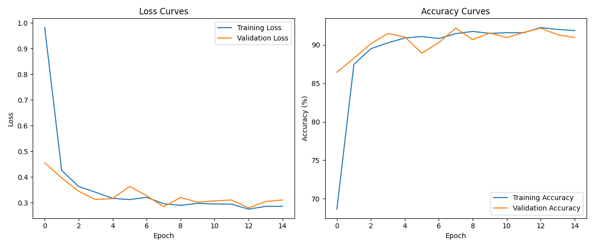
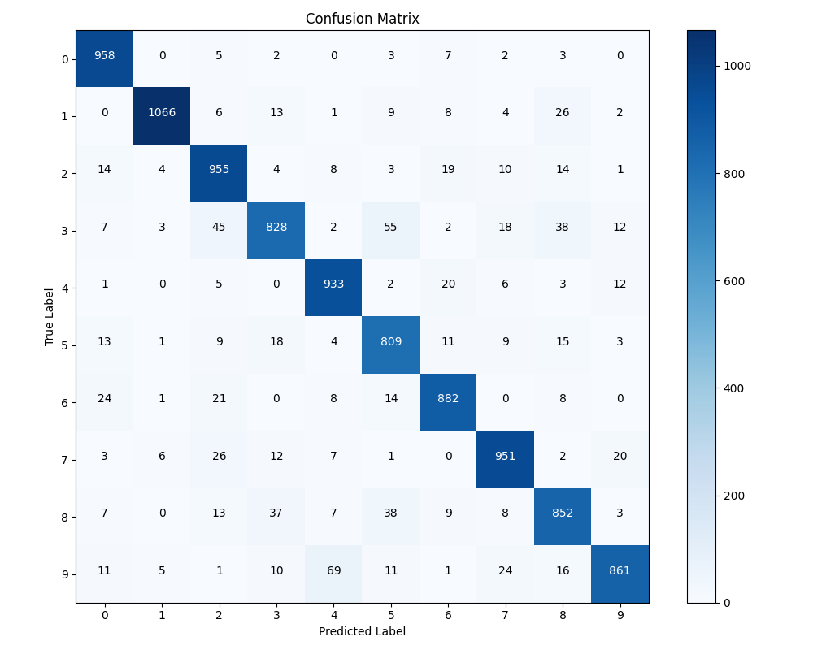
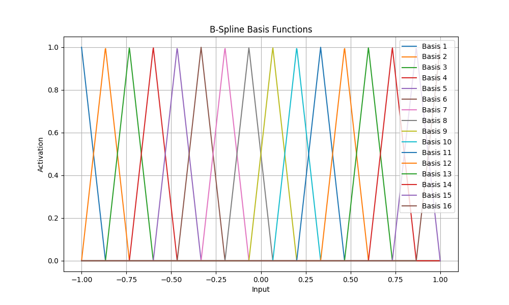

# Kolmogorov-Arnold Network (KAN) on MNIST

This repository implements a Kolmogorov-Arnold Network (KAN) for image classification on the MNIST dataset. The KAN leverages B-spline basis functions within custom neural network layers to model complex nonlinear relationships, and is evaluated on the standard MNIST handwritten digits benchmark.

## Project Structure

- **Run.py**: Main script to train, evaluate, and visualize the KAN on MNIST.
- **/results/**: Contains training curves, confusion matrix, basis function visualizations, and metrics.
- **/checkpoints/**: Model checkpoints saved after each epoch.
- **/data/**: MNIST dataset is downloaded here.

## How It Works

- The model is built from scratch using PyTorch, with custom B-spline basis function layers.
- The `MNISTKAN` model first reduces the dimensionality of the input, then passes it through KAN layers.
- The training script logs training/testing loss and accuracy, saves checkpoints, and generates diagnostic plots.

### Key Components in `Run.py`

- `BSplineBasis` and `KANLayer`: Custom PyTorch modules for B-spline based neural network layers.
- `MNISTKAN`: Model architecture for MNIST, with dimensionality reduction and two KAN layers.
- Training loop: Runs for 15 epochs and saves metrics/results.
- Visualization: Plots loss/accuracy curves, confusion matrix, and basis functions.

## Results

### Metrics

- **Final Test Accuracy:** 90.95%
- **Final Test Loss:** 0.3104
- **Training & Test Curves:** See plots below for training/testing loss and accuracy over epochs.

#### Hyperparameters

- Batch size: 128
- Learning rate: 0.001
- Epochs: 15
- Hidden dimension: 64
- B-spline basis functions: 16

### Output Visualizations

| Training Curves | Confusion Matrix | B-spline Bases |
|---|---|---|
|  |  |  |

## Usage

1. **Install requirements:**  
   This project requires Python 3, PyTorch, torchvision, matplotlib, numpy, tqdm.

   ```bash
   pip install torch torchvision matplotlib numpy tqdm
   ```

2. **Run training and evaluation:**

   ```bash
   python Run.py
   ```

   - Model checkpoints and results will be saved in `checkpoints/` and `results/`.

## Reference Results

- Training and testing accuracy/loss per epoch are recorded in [`results/kan_metrics.json`](results/kan_metrics.json).
- All plots are saved in the `results/` folder after training.

## Notes

- The MNIST dataset is automatically downloaded to the `data/` directory.
- Checkpoints are saved after each epoch for reproducibility.
- Results are generated with deterministic seeds for reproducibility.

---

Feel free to adapt this README for additional details or to describe extensions to the KAN architecture!
